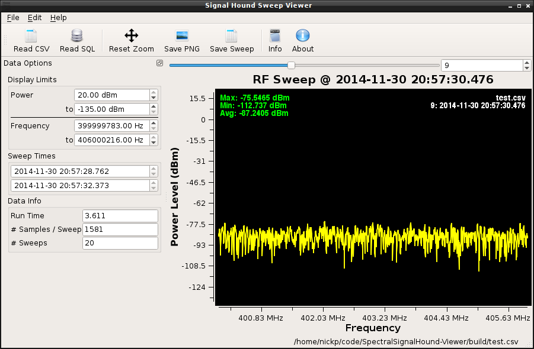
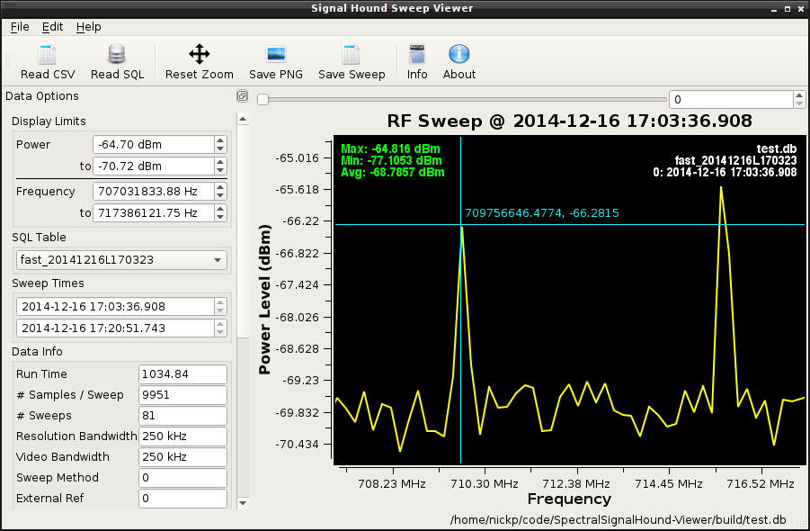

SpectralSignalHound-Viewer
==========================

Spectral Signal Hound Viewer is a front end display for the Spectral Signal Hound data logger.  It provides a simple interface to view, export, and analyze sweep data. It is able to handle large / long (multi-hour / multi-GB) sweeps.

# Dependancies / Requirements

- cmake >= 2.8.11
- qt5.x
- qwt6 (trunk)
- stxxl - included as a git submodule (to be used)

# Building

Currently, this only builds on Linux variants, but could work on Windows and OS X with some effort (due to cmake)

```sh
	
	git clone --recursive https://github.com/npotts/SpectralSignalHound-Viewer
	cd SpectralSignalHound-Viewer
	svn checkout svn://svn.code.sf.net/p/qwt/code/trunk/qwt
	cd qwt && qmake && make #there my be some errors when building Qt Designer components, its a dont care.
	mkdir build
	cd build
	cmake ..
	make
```

#Eye Candy

Because...  darn it, I like pictures.

## Main Display Window


## With a CSV Sweep Loaded



## Zooming in on a SQL Sweep



## Metadata Shown from SQL Database


# Shortcuts | Hotkeys

| Hotkey / Shortcut  | Functionality                                 |
|--------------------------|:----------------------------------------|
| Ctrl + Q                 | Quit                                    |
| Ctrl + O                 | Open a SQL Database of Sweeps           |
| Ctrl + Shift + O         | Open a CSV Sweep                        |
| Ctrl + S                 | Save currently displayed sweep as PNG   |
| Ctrl + Shift + S         | Save data from currently displayed sweep|
| Ctrl + ?                 | Show manual (this document)             |
| Ctrl + F1                | Show information about Program          |

#Zooming
You can zoom in on the plot via Mouse1 click and hold.  This zoom window will be maintained during changes in the sweep index, so that you can effectively zoom in on a range and watch it changes over time.  In order to back out, you can click the __Fix Zoom__ button, which will reset the zoom to the largest view.

# Manual?  We don't need no stinking manual!

Honestly, you should be able to figure it out.  Its not that complicated.

1. Load a Sweep (CSV or Database)
1. Scroll through sweeps
1. Profit???!?!!?


#Readable Data formats
This describes the data formats understood and read.

##CSV format
This defines the CSV format that is expected.

- Line #1: Literal ```timestamp,temperature,freq0, freq1, freq2, ..., freqn``` where freq0, ... freqn look like 400000000, ... 500000000 for a sweep between 400 to 500 MHz.  EG ```timestamp,temperature,399999783,400003580, ... ,405996419,406000216```
- Line #2 to m (=number of sweeps):
	- Timestamp in __YYYY-MM-DD HH:MM:SS.ZZZ__ format
	- Temperature in double format (can be zero);
	- Comma seperated values measured at associated frequency.
	- Example:  ```2014-11-30 20:57:28.762365,31.875,-83.5439,-88.6389, ... ,-88.5187,-92.3722```


##SQLite data format
The standard sweep_metadata database is created via the statement below. SpectralSignalHound only defines 
```data_table``` and ```timestamp``` values, where the rest of the items are pulled from the configuring
structure.

```sql
	CREATE TABLE IF NOT EXISTS sweep_metadata (
		rowid INTEGER NOT NULL PRIMARY KEY,
		data_table TEXT, 
		timestamp DEFAULT CURRENT_TIMESTAMP NOT NULL,
		m_startFreq DOUBLE NOT NULL,
		m_stopFreq DOUBLE NOT NULL,
		m_centerFreq DOUBLE NOT NULL,
		m_spanFreq DOUBLE NOT NULL,
		m_stepFreq DOUBLE NOT NULL,
		m_stepAmpl DOUBLE NOT NULL,
		m_refLevel DOUBLE NOT NULL,
		m_refLevelOffset DOUBLE NOT NULL,
		m_refUnitsmV INTEGER NOT NULL,
		m_logDbDiv DOUBLE NOT NULL,
		m_attenIndex INTEGER NOT NULL,
		m_scaleLin BOOLEAN NOT NULL,
		m_AmplUnits INTEGER NOT NULL,
		m_signalTrackOn BOOLEAN NOT NULL,
		m_vidAvg INTEGER NOT NULL,
		m_TrigVideo BOOLEAN NOT NULL,
		m_TrigPos DOUBLE NOT NULL,
		m_CalOutSyncTrig INTEGER NOT NULL,
		m_videoTriggerLevel DOUBLE NOT NULL,
		m_ZSMode INTEGER NOT NULL,
		m_RBWSetpoint INTEGER NOT NULL,
		m_VBWSetpoint INTEGER NOT NULL,
		m_VDMMA INTEGER NOT NULL,
		m_VDMode INTEGER NOT NULL,
		m_UseExtRef BOOLEAN NOT NULL,
		m_RBWIsAuto BOOLEAN NOT NULL,
		m_VBWIsAuto BOOLEAN NOT NULL,
		m_SWPTMSetpoint INTEGER NOT NULL,
		m_maxHold BOOLEAN NOT NULL,
		m_suppressImage BOOLEAN NOT NULL,
		m_decimation INTEGER NOT NULL,
		m_MarkerSelected INTEGER NOT NULL,
		m_sweepMode INTEGER NOT NULL,
		m_sweepTime DOUBLE NOT NULL,
		m_Averaging INTEGER NOT NULL,
		m_DetectorPasses INTEGER NOT NULL,
		m_SubTraceCount INTEGER NOT NULL,
		m_FFTSize INTEGER NOT NULL,
		m_ExtMixerOffset DOUBLE NOT NULL,
		m_ZSFreqPeak DOUBLE NOT NULL,
		m_ZSSweepTime DOUBLE NOT NULL,
		m_SweepsToDo INTEGER NOT NULL,
		m_Overpowered INTEGER NOT NULL,
		m_PreampOn INTEGER NOT NULL,
		m_PNStartDecade INTEGER NOT NULL,
		m_PNStopDecade INTEGER NOT NULL,
		m_channelBW DOUBLE NOT NULL,
		m_channelSpacing DOUBLE NOT NULL,
		m_BBSPSetpt INTEGER NOT NULL,
		m_serialNumber INTEGER NOT NULL,
		m_HzPerPt DOUBLE NOT NULL,
		m_traceSize INTEGER NOT NULL,
		m_SubTraceSize INTEGER NOT NULL
	);
```

Where data sweeps are stored in a table with like

```sql
	CREATE TABLE <table_name> (
		rowid INTEGER NOT NULL PRIMARY KEY,
		timestamp DEFAULT CURRENT_TIMESTAMP NOT NULL,
		header_row BOOLEAN DEFAULT FALSE NOT NULL,
		temperature DOUBLE NOT NULL,
		csv TEXT NOT NULL
	);
```
There must exist an header entry with a similar insert 
```sql
	INSERT INTO <table_name> (
		NULL, 
		"2014-12-13 14:15:16.17", 
		"true", 
		"N/A", 
		"300000000,300002000, ... , 399998000,400000000"
	);
```

where actual sweep values are inserted like thus:

```sql
	INSERT INTO <table_name> (
		NULL, 
		"2014-12-13 14:15:19.20", 
		"false", 
		"23.4", 
		"-135,-135, ... , -135,-135"
	);
```


Additionally, the RBW and VBW are essentially look up table values, and are resolved via something like:

```c
	QString rtn("??");
	switch(v) {
	    case  2: rtn = "5 MHz"; break;
	    case  3: rtn = "250 kHz"; break;
	    case  4: rtn = "100 kHz"; break;
	    case  5: rtn = "50 kHz"; break;
	    case  6: rtn = "25 kHz"; break;
	    case  7: rtn = "12.5 kHz"; break;
	    case  8: rtn = "6.4 kHz"; break;
	    case  9: rtn = "3.2 kHz"; break;
	    case 10: rtn = "1.6 kHz"; break;
	    case 11: rtn = "800 Hz"; break;
	    case 12: rtn = "400 Hz"; break;
	    case 13: rtn = "200 Hz"; break;
	    case 14: rtn = "100 Hz"; break;
	    case 15: rtn = "50 Hz"; break;
	    case 16: rtn = "25 Hz"; break;
	    case 17: rtn = "12.5 Hz"; break;
	    case 18: rtn = "6.4 Hz"; break;
	    case 19: rtn = "3.2 Hz"; break;
	    case 20: rtn = "1.6 Hz"; break;
	    case 21: rtn = ".8 Hz"; break;
	    case 22: rtn = ".4 Hz"; break;
	    case 23: rtn = ".2 Hz"; break;
	    case 24: rtn = ".1 Hz"; break;
  	}
```

Or this table

|Value| RBW / VBW |Value| RBW / VBW |Value| RBW / VBW |
|:---:|:---------:|:---:|:---------:|:---:|:---------:|
| 2   |5 MHz      |10   |1.6 kHz    |18   |6.4 Hz     |
| 3   |250 kHz    |11   |800 Hz     |19   |3.2 Hz     |
| 4   |100 kHz    |12   |400 Hz     |20   |1.6 Hz     |
| 5   |50 kHz     |13   |200 Hz     |21   |.8 Hz      |
| 6   |25 kHz     |14   |100 Hz     |22   |.4 Hz      |
| 7   |12.5 kHz   |15   |50 Hz      |23   |.2 Hz      |
| 8   |6.4 kHz    |16   |25 Hz      |24   |.1 Hz      |
| 9   |3.2 kHz    |17   |12.5 Hz    |other| ??        |
